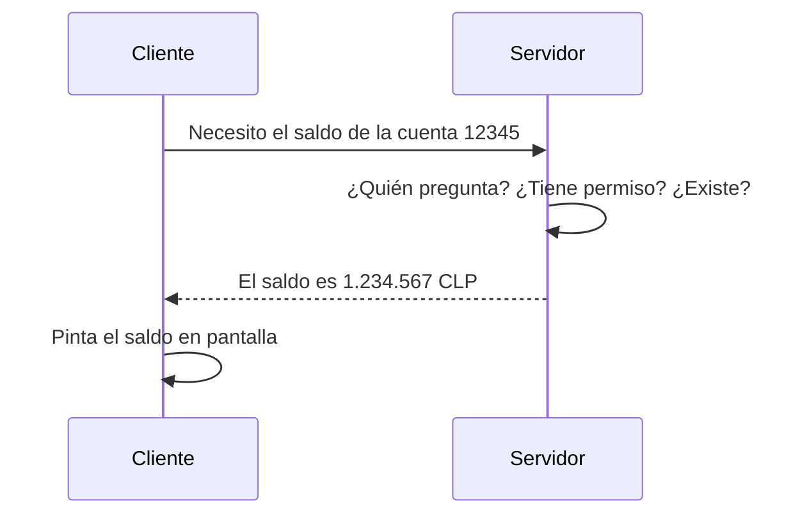

# Fundamentos de APIs

> Este documento es la lectura lineal del módulo. La experiencia primaria está
> en `index.html`, donde los conceptos se operan con componentes interactivos.
> Aquí los tienes en prosa para repaso, búsqueda o futuro chatbot RAG.

## Por qué este módulo importa

Cuando un cliente bancario te dice *“estamos exponiendo nuestra API a los TPPs”*,
hay tres palabras técnicas en esa frase. La primera es **API**. Si no la tienes
clara, no entiendes qué está exponiendo, ni a quién, ni qué controla.

Este es el módulo cero del bagaje técnico — el que te permite asentir con
conocimiento, no por compromiso. Sin él, los módulos 02 (HTTP, REST y JSON)
y 03 (TLS y mTLS) son palabras flotando.

## 1. Qué es exactamente una API

**API** son las siglas de *Application Programming Interface*. La traducción
literal — *interfaz de programación de aplicaciones* — es la peor manera de
explicarla. La buena: una **API es un contrato** entre dos sistemas. Define:

- **Qué se puede pedir** (los endpoints disponibles).
- **Cómo hay que pedirlo** (parámetros, formato).
- **Qué se va a devolver** (estructura de la respuesta).
- **Qué pasa cuando algo falla** (códigos de error y su significado).

Una API es una promesa publicada por un servidor sobre lo que sabe responder.
No se descarga, no se instala, no se ve por una pantalla — se consume a través
de la red.

## 2. Cliente y servidor — los dos roles

Toda llamada a una API tiene dos partes:

- **Cliente**: el sistema que **pide** el dato. Puede ser una app móvil, un
  agregador financiero, un iniciador de pagos, otro banco.
- **Servidor**: el sistema que **tiene** el dato y responde. En Open Finance,
  típicamente es la API del banco (ASPSP, IPI, IPC).

Importante: cliente y servidor son **roles**, no entidades fijas. Un mismo
sistema puede ser cliente en una llamada y servidor en otra. El banco que
expone su API a TPPs es servidor en esa llamada — pero cuando ese mismo
banco consulta el Directorio del ecosistema Open Finance chileno, ahí es cliente.

### Anatomía mínima de una llamada

1. **El cliente formula la petición** — sabe qué quiere y conoce la dirección
   donde pedirlo.
2. **El servidor procesa** — verifica quién pregunta, si tiene permiso, si lo
   pedido existe.
3. **El servidor responde** — devuelve el dato en un formato acordado de
   antemano (típicamente JSON).
4. **El cliente usa la respuesta** — la pinta, la suma, la pasa a otro
   sistema, decide.

Cliente y servidor no se conocen — solo conocen el contrato. Esa es la magia
de las APIs: cualquier cliente compatible puede consumir cualquier servidor
compatible.

## 3. Endpoint y contrato

Una API es un conjunto de **endpoints**. Cada endpoint es una dirección
concreta dentro de la API que responde un tipo específico de petición. Por
ejemplo:

- `GET /accounts/{id}/balance` — consulta el saldo de una cuenta.
- `POST /payments` — inicia un pago.
- `GET /consents/{id}` — recupera el estado de un consentimiento.

El **contrato** de la API es la documentación que describe todos sus endpoints:
qué método HTTP usa cada uno (lo verás en el módulo 02), qué parámetros
acepta, qué devuelve cuando todo va bien, y qué errores puede producir.

En Open Finance los contratos se publican típicamente en **OpenAPI** (también
llamado **Swagger**, que es la herramienta histórica). Cualquier consumidor
puede leer el Swagger y saber qué espera la API antes de escribir una sola
línea de código.

## 4. API vs SDK vs librería

Tres palabras que el cliente bancario usará como sinónimos. No lo son.

| Concepto | Qué es | Dónde vive | Atado a un lenguaje |
|----------|--------|------------|---------------------|
| **API** | El contrato — qué se puede pedir y cómo | En el servidor; accedes por red | No, cualquier cliente compatible |
| **SDK** | Una caja de herramientas para consumir la API | Código que descargas e integras en tu app | Sí (SDK Java, SDK Python…) |
| **Librería** | Cualquier paquete de código reutilizable | Dentro de tu app | Sí, normalmente |

Una API puede tener varios SDKs (uno por lenguaje), o ninguno. El SDK no
es la API: es una capa de conveniencia para no escribir las llamadas a mano.

## 5. Caso real: el Directorio Open Finance chileno

En Chile, el Sistema de Finanzas Abiertas mantiene un Directorio donde están
registrados todos los actores autorizados: **PSIPs**, **PSBIs**, **IPIs**,
**IPCs**.

Cuando un banco recibe una solicitud de registro de un TPP que dice estar
autorizado, no llama a la CMF por teléfono — consulta el Directorio. Y lo
consulta como API: el portal del desarrollador del ecosistema Open Finance
chileno publica los endpoints disponibles para listar organizaciones,
recuperar atributos de una en particular, y obtener su SSA firmado para
validar el registro DCR.

Cada banco escribe el código que consume esos endpoints. No descarga el
motor del Directorio. No accede directo a la base. Solo llama a los
endpoints — y ahí está la promesa de una API: aislamiento por contrato.

Este es el patrón que se replica en cada ecosistema Open Finance regulado de
la región: una API central del directorio (en Chile ya operativa; en Perú
en construcción tras la confirmación de la SBS de lanzar su propio
Directorio), y APIs por banco para sus cuentas.

## 6. Lo que tienes que poder explicar a un cliente

Tres preguntas que vas a oír en cada conversación con un arquitecto bancario.

### «Si nuestros datos ya están en el portal web, ¿para qué necesitamos exponer una API encima?»

Porque el portal web está pensado para personas — un humano lee, hace clic,
decide. La API está pensada para sistemas — otra aplicación llama, recibe
datos estructurados y opera con ellos sin intervención humana. En Open
Finance el consumidor es siempre otro sistema: un agregador, un iniciador
de pagos, un banco competidor. Sin API no hay forma de que ese sistema
acceda a sus datos de forma segura, auditada y controlada por el usuario.

### «¿Y si simplemente damos acceso directo a nuestra base de datos a los TPPs? Sería más rápido.»

Sería un desastre técnico y regulatorio. Tres problemas concretos: **uno**,
exponer la base rompe el aislamiento — el consumidor vería todo, sin
granularidad por usuario ni por scope. **Dos**, ata al TPP a tu schema
interno: cuando modifiques una tabla, le rompes la integración. **Tres**,
no hay forma de auditar quién consultó qué — y el regulador lo exige. La
API resuelve los tres: expone solo lo permitido, mantiene un contrato
estable aunque cambies el motor, y registra cada llamada con identificador
único.

### «Entonces si exponemos la API, ¿cualquiera puede