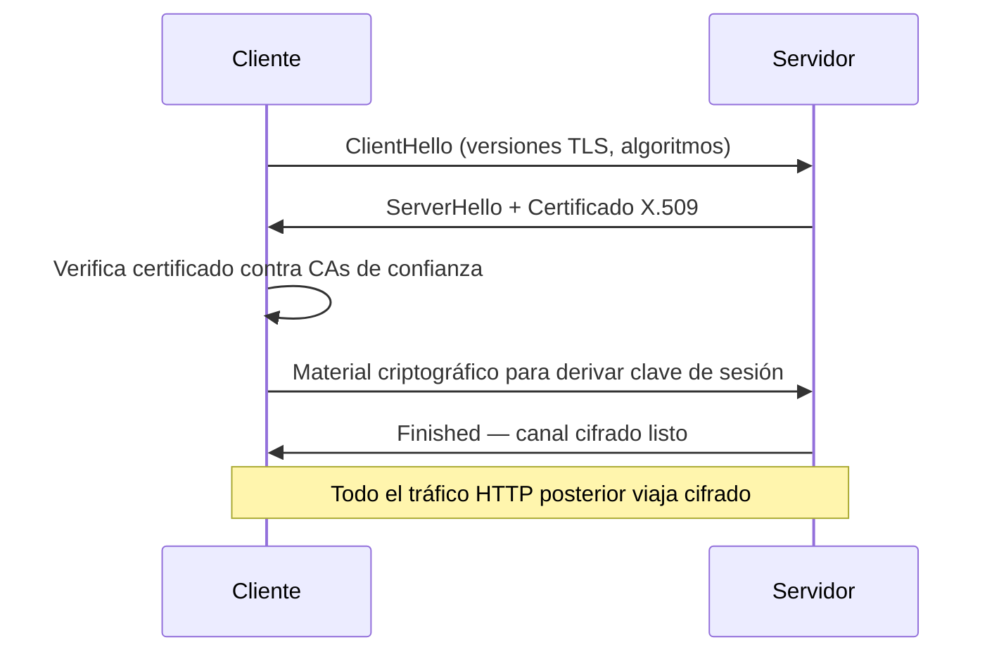
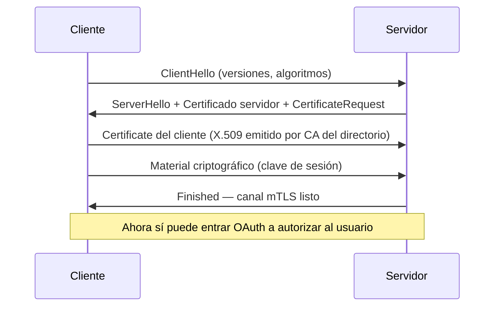

# Seguridad de transporte — TLS y mTLS

## Por qué este módulo importa para tu día a día

En cualquier conversación con un cliente bancario sobre Open Finance, los estándares técnicos aparecen en los primeros diez minutos. Y en esos diez minutos vas a oír "mTLS", "certificado de cliente", "FAPI 2.0". Si no entiendes qué pasa en la capa de transporte, no puedes responder por qué un PSIP necesita certificados de cliente para conectarse al sandbox del FAD chileno, ni por qué la Ley Fintech de Chile exige FAPI 2.0. Este módulo cubre justo esa capa.

## Lo que vas a saber al final

- Cómo funciona TLS por debajo: el handshake paso a paso, qué problema resuelve y dónde fallaría sin él.
- Qué añade mTLS y por qué los reguladores Open Finance lo exigen.
- Qué es un certificado X.509, quién los emite y cómo se valida la cadena de confianza.
- Cómo se ven los flujos en una arquitectura Open Finance real, con el FAD chileno como caso ancla y la SBS de Perú como adaptación regional viva.

## 1. ¿Qué es exactamente TLS?

TLS (Transport Layer Security) es el protocolo que cifra las comunicaciones entre cliente y servidor sobre la red. Es la "S" de HTTPS. Antes de transmitir cualquier dato, ambas partes negocian: deciden qué versión del protocolo van a usar, qué algoritmos de cifrado, e intercambian claves. Esa negociación se llama *handshake*.

Visualizado como secuencia:



Lo importante: en TLS estándar, **solo el servidor demuestra quién es**. El cliente confía en él, pero el servidor no sabe quién es el cliente. Eso para una web pública sirve — la identidad del usuario se valida después con un login. Para una API regulada Open Finance, no.

## 2. mTLS: cuando el servidor también desconfía del cliente

mTLS (mutual TLS) es la misma negociación, pero con dos pasos adicionales: el servidor pide al cliente que se identifique (`CertificateRequest`), y el cliente envía su propio certificado X.509. Ambos verifican el certificado del otro. Si el certificado del cliente no es legítimo, está expirado, o no está firmado por una CA reconocida del directorio del ecosistema, el handshake se cierra antes de procesar siquiera la petición HTTP.

El handshake mTLS estricto, paso a paso:



Por qué los reguladores Open Finance lo exigen:

- Filtra ataques a nivel de red: solo TPPs registrados con cert válido pueden iniciar conversación.
- Refuerza non-repudiation: cada llamada queda asociada a un cert concreto trazable a una organización.
- Pone una capa de seguridad antes que OAuth, no en lugar de él. Si el handshake falla, OAuth ni siquiera se ejecuta.

FAPI 2.0 — el perfil de seguridad financiera que adoptan PSD2/EBA en Europa, OBIE en UK, Open Finance Brasil, el SFA chileno bajo la Ley Fintech, y otros — exige mTLS como mínimo de transporte (ver RFC 8705 para el detalle de `tls_client_auth`).

| Aspecto                                  | TLS estándar | mTLS    |
|------------------------------------------|--------------|---------|
| Servidor presenta certificado            | Sí           | Sí      |
| Canal cifrado                            | Sí           | Sí      |
| Cliente presenta certificado             | No           | **Sí**  |
| Servidor valida identidad del cliente    | No           | **Sí**  |
| Requerido por FAPI 2.0                   | No           | Sí      |

## 3. Certificados X.509 y la cadena de confianza

Un certificado X.509 es un archivo digital firmado por una **CA (Certificate Authority)**. Contiene: a quién pertenece (subject), quién lo emitió (issuer), su clave pública, una fecha de validez y la firma de la CA. La firma se verifica usando la clave pública de la CA, que está pre-instalada en navegadores y sistemas como "raíz de confianza".

En Open Finance, las CAs no son las genéricas de Internet. Son CAs específicas del directorio regulatorio: la CA del FAD chileno, la CA del Open Finance Brasil, etc. Eso permite controlar quién entra al ecosistema. Si tu certificado no fue emitido por la CA del directorio, no eres jugador legítimo.

## 4. Caso real: el FAD chileno y el flujo DCR

El Sistema de Finanzas Abiertas (SFA) chileno se crea por la **Ley Fintech de Chile** y la implementa la CMF. La especificación técnica vive en el [Confluence público del FAD](https://openfinancechile.atlassian.net/wiki/spaces/OFAC/overview) y en el portal del desarrollador, donde el equipo Open Business de Minsait participa activamente en la construcción del estándar.

El documento **FAD v1.0.1 — Dynamic Client Registration** define cómo un PSIP o un PSBI se registra contra un Authorization Server (IPI o IPC) del banco. Lo interesante es cómo articula mTLS con la autenticación de cliente:

1. **Registro previo en el Directorio.** El TPP, ya autorizado regulatoriamente por la CMF, obtiene del Directorio dos elementos: su certificado X.509 (firmado por la CA del Directorio) y su SSA (Software Statement Assertion — un JWT firmado en PS256 que contiene los atributos verificados de la organización: `organization_id`, `roles`, `jwks_uri`).
2. **POST /register con mTLS.** El PSIP llama al `POST /register` del banco. La conexión exige mTLS desde el primer byte. Sin certificado válido, no hay handshake.
3. **Validación del SSA.** El Authorization Server valida la firma PS256 del SSA contra el JWKS del Directorio. Verifica vigencia (`exp`), audiencia (`aud`) e identificador único (`jti`).
4. **Emisión de credenciales.** Si todo cuadra, el banco emite un `client_id` con `token_endpoint_auth_method: tls_client_auth`. No se admiten secretos compartidos: `client_secret_basic` y `client_secret_post` están prohibidos por el FAD.
5. **Llamadas operativas.** A partir de ahí, cada llamada a `/payments` o `/accounts` presenta el mismo cert en el handshake mTLS y un access token JWT firmado en PS256.

```http
POST /register HTTP/1.1
Host: as.banco.cl
Content-Type: application/json

{
  "software_statement": "eyJhbGciOiJQUzI1NiIsInR5cCI6IkpXVCJ9...",
  "redirect_uris": ["https://app.cl/callback"],
  "grant_types": ["authorization_code"],
  "token_endpoint_auth_method": "tls_client_auth",
  "jwks_uri": "https://app.cl/.well-known/jwks.json",
  "scope": "openid accounts payments"
}
```

La consecuencia práctica: si un PSIP no consigue su SSA y su cert del Directorio, no puede ni siquiera intentar hablar con los bancos. La barrera es regulatoria y técnica al mismo tiempo.

## 5. Adaptación a la región: SBS Perú

La Superintendencia de Banca, Seguros y AFP del Perú ha confirmado que **va a lanzar un Directorio peruano** para Open Finance. Esa pieza institucional es justo la que el modelo chileno exige para funcionar — y es la decisión política que la SBS está tomando ahora.

La consecuencia práctica para un consultor de Open Business:

- **La capa técnica del FAD se traslada tal cual.** FAPI 2.0, mTLS RFC 8705, DCR sobre RFC 7591/7592, SSA firmado en PS256, prohibición de `client_secret_basic`, exigencia de `tls_client_auth`. Todo eso es defendible con experiencia probada del FAD chileno.
- **Lo que cambia es la pieza institucional.** Quién opera el Directorio peruano, qué CA emite los certificados de cliente, cómo se nombran los roles regulados peruanos (probablemente ITF, OPF u otros, no PSIP/PSBI). Eso lo decide la SBS, no Minsait.
- **El posicionamiento correcto a un cliente bancario peruano** no es "copiemos lo de Chile". Es: *aplicamos los mismos estándares globales que ya demostramos en el FAD, ajustados a la arquitectura institucional que la SBS defina*. Esa diferencia de matiz importa al regulador.

| Pieza                              | ¿Trasladable de Chile a Perú?  |
|------------------------------------|--------------------------------|
| FAPI 2.0 como perfil de seguridad  | Sí, directamente               |
| mTLS RFC 8705 + tls_client_auth    | Sí, directamente               |
| DCR sobre RFC 7591/7592            | Sí, directamente               |
| Estructura del SSA (JWT PS256)     | Sí, directamente               |
| Prohibición de client_secret_basic | Sí, recomendable               |
| Quién opera el Directorio          | **No** — lo define SBS         |
| Qué CA emite los certs             | **No** — lo define SBS         |
| Mapeo de roles regulados           | **No** — terminología peruana  |
| Política de retención de auditoría | **No** — Ley 29733 aplica      |

El mismo razonamiento aplicará cuando hagamos la conversación con CNBV (México), SFC (Colombia) y otros. La diferencia siempre estará en lo institucional, no en lo técnico.

## 6. Lo que tienes que poder explicar a un cliente

> *Cliente arquitecto:* "¿Por qué necesitamos mTLS si ya estamos usando OAuth?"
>
> *Tú:* "Porque mTLS opera en una capa distinta: cierra el canal de transporte y prueba la identidad del *cliente* a nivel de red, antes de que OAuth gestione la autorización del *usuario*. Son capas complementarias. Sin mTLS, cualquiera puede intentar el handshake; con mTLS, solo TPPs registrados llegan a hablar con tu servidor. Y FAPI 2.0 las exige a las dos, no como alternativas."

## Glosario rápido del módulo

- **TLS** — Transport Layer Security. Protocolo que cifra el canal entre cliente y servidor.
- **mTLS** — TLS con autenticación mutua (cliente y servidor presentan certificado).
- **Handshake** — Negociación inicial donde se acuerdan versión, algoritmos y claves.
- **X.509** — Estándar de certificados digitales.
- **CA** — Certificate Authority. Entidad que emite y firma certificados confiables.
- **FAPI 2.0** — Financial-grade API. Perfil de seguridad financiera que endurece OAuth y exige mTLS.
- **ASPSP** — Account Servicing Payment Service Provider. El banco que expone las APIs reguladas.
- **TPP** — Third Party Provider. Tercero autorizado a consumir las APIs (AISP, PISP, etc.).
- **PSIP** — Proveedor de Servicios de Iniciación de Pagos (terminología CMF Chile, equivalente a PISP).
- **PSBI** — Prestador de Servicios Basados en Información (terminología CMF Chile, equivalente a AISP).
- **IPI / IPC** — Institución Proveedora de Información / de Cuentas de Pago. Banco que expone APIs reguladas en el SFA chileno.
- **DCR** — Dynamic Client Registration (RFC 7591). Mecanismo estándar para que un cliente obtenga credenciales del directorio.
- **SSA** — Software Statement Assertion. JWT firmado por el Directorio que prueba que la organización está autorizada.
- **FAD** — Finanzas Abiertas Chile. Espacio técnico que aterriza los detalles operativos de la Ley Fintech.

## Próximo paso

En el módulo 04 (OAuth, OpenID Connect, FAPI) verás qué pasa **por encima** de este canal seguro: cómo se autoriza al usuario final, qué es un access token JWT, qué añade FAPI 2.0 sobre OAuth puro, y cómo encajan PAR, RAR y PKCE.
